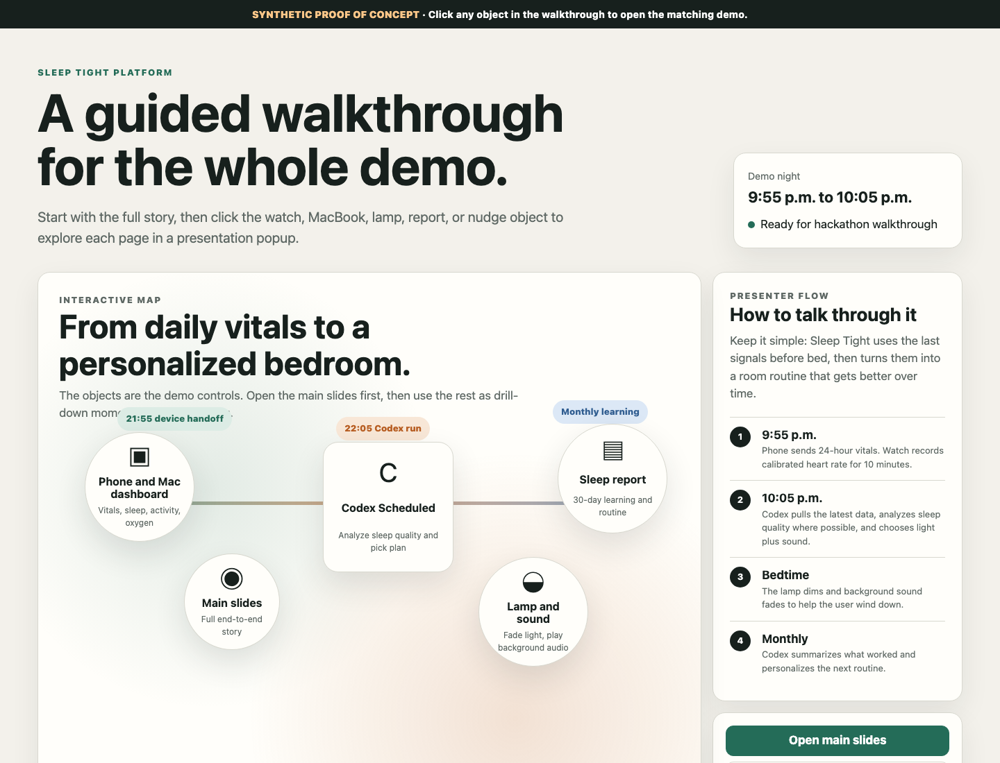
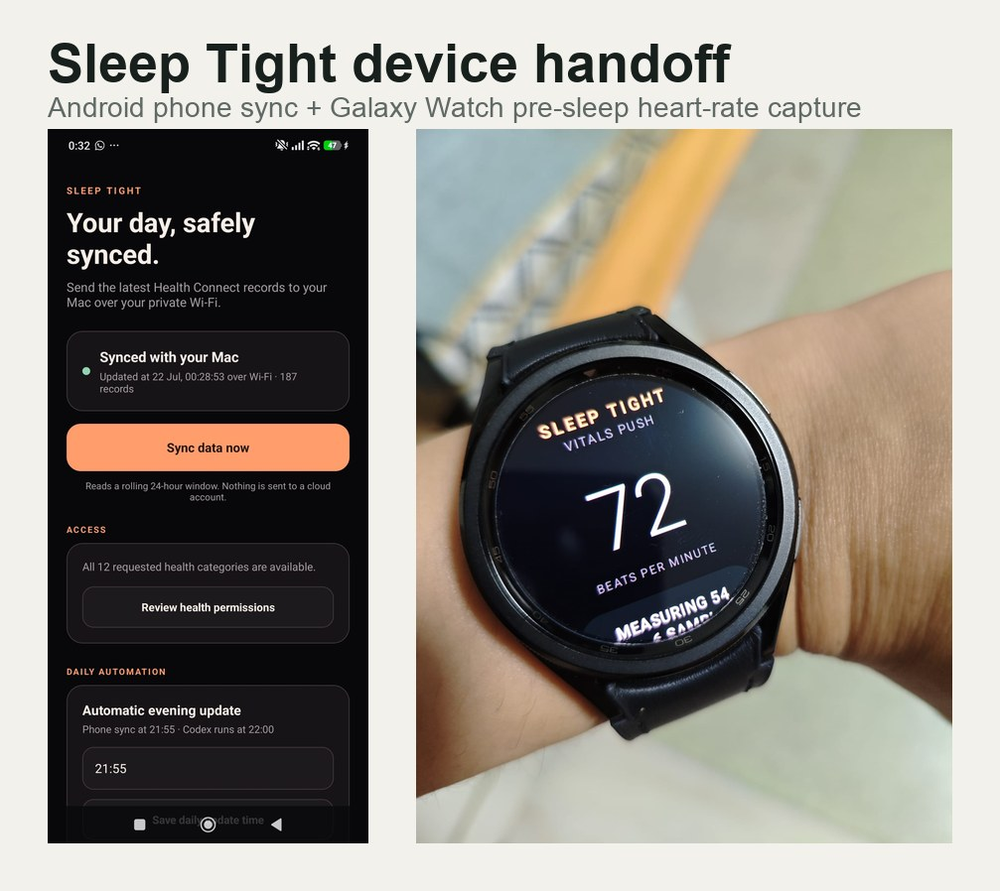
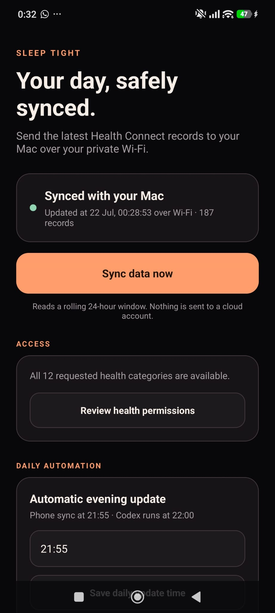
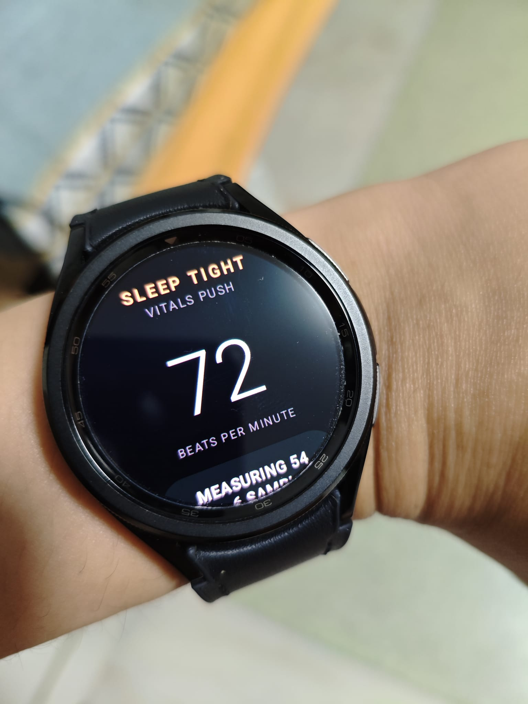
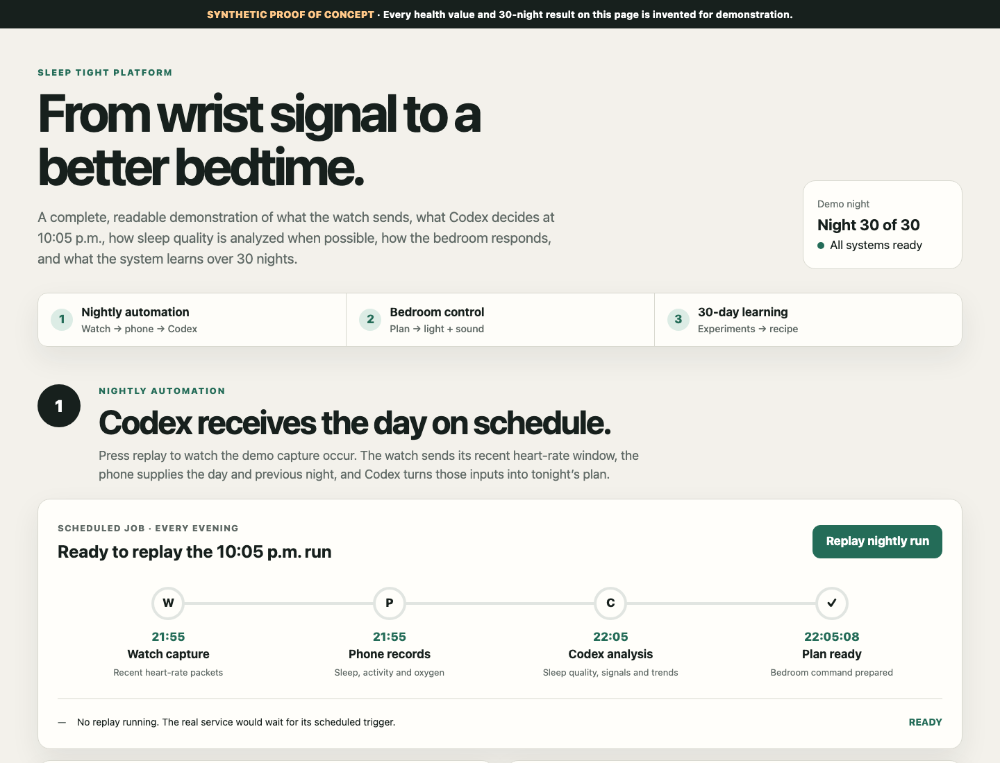
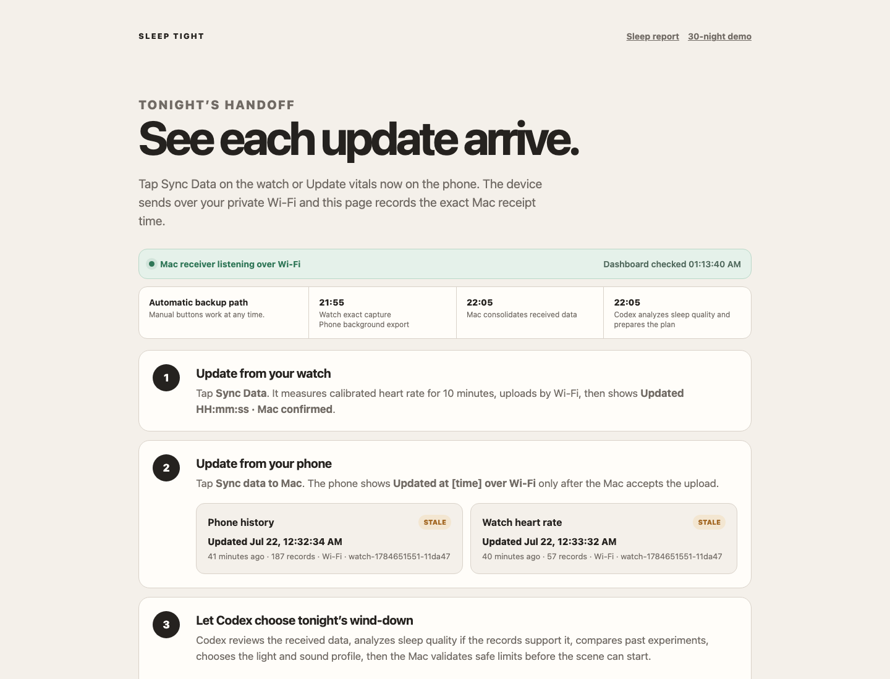
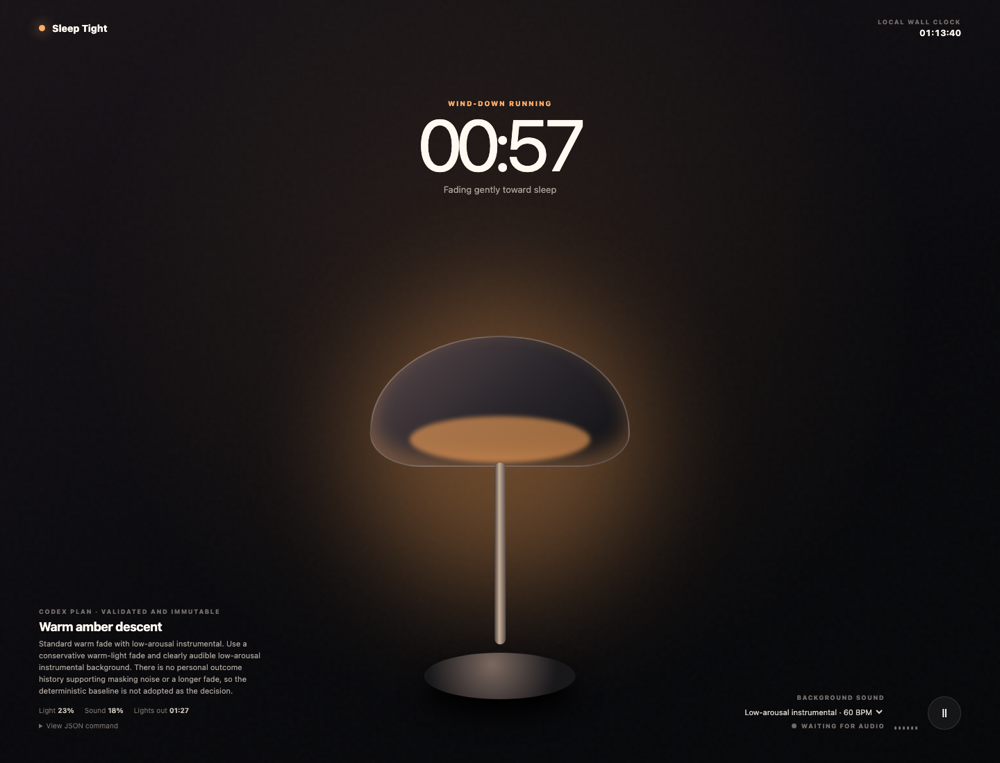
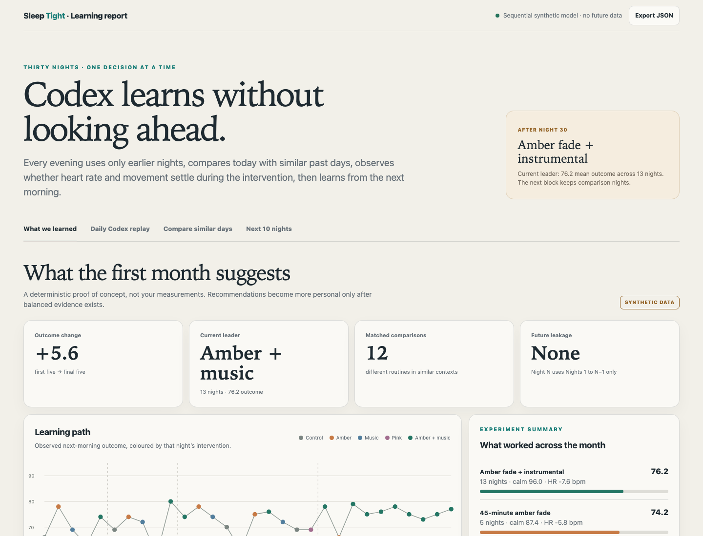
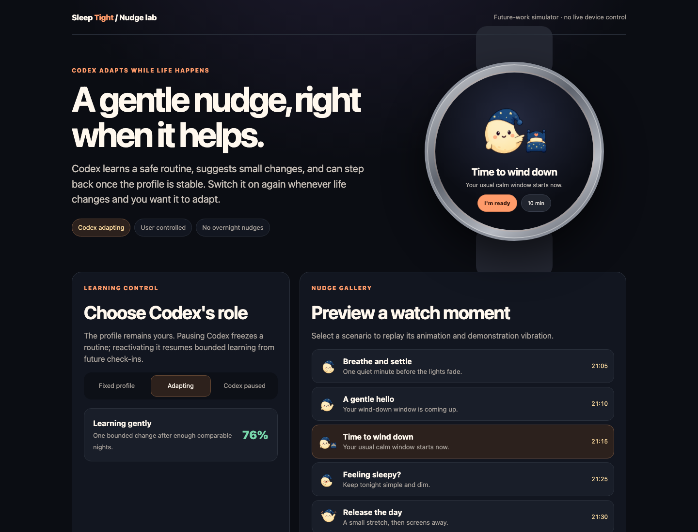
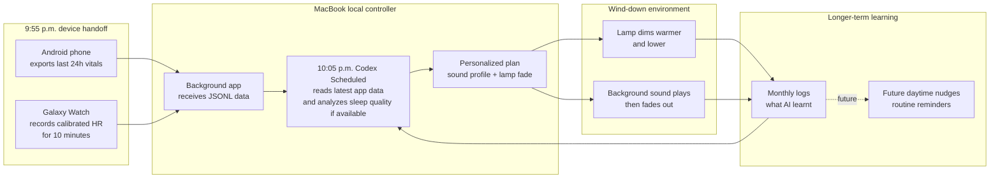

# Sleep Tight

## Start Here: Let Codex Set Up The Demo

Open Codex in this repository, copy the full prompt below, and let it prepare the Mac receiver, install the required pieces, launch the local demo pages, and walk you through connecting the phone and Galaxy Watch.

```text
You are helping me set up Sleep Tight from this GitHub repository.

Goal:
Run the full Sleep Tight hackathon demo locally, connect my Android phone and Samsung Galaxy Watch where possible, and give me clear step-by-step instructions until the Mac dashboard, lamp simulation, sleep report, and future nudge demo all work.

Please do the following:
1. Inspect the repository structure and explain the three-part system: Android phone app, Galaxy Watch app, and Mac local receiver.
2. Install or verify the local dependencies needed for the Mac receiver and demo pages.
3. Start the Mac receiver/background app so it can accept phone and watch data.
4. Launch the local demo pages:
   - Main slides: computer/platform-demo.html
   - Main dashboard: computer/dashboard.html
   - Lamp simulation: computer/wind-down-demo.html
   - Sleep report: computer/sleep-report.html
   - Future nudge simulator: research/codex-nudge-simulator.html
5. Help me connect the Android phone app so it can export the last 24 hours of Health Connect vitals to the Mac.
6. Help me connect the Galaxy Watch app so it can capture the final 10-minute pre-sleep heart-rate window and send it to the Mac.
7. Verify that the dashboard receives data. If real device data is unavailable, use the synthetic demo data and clearly label it as synthetic.
8. Explain the nightly workflow in presentation terms: 9:55 p.m. device handoff, 10:05 p.m. Codex Scheduled analysis, lamp and background sound wind-down, monthly learning logs, and future daytime nudges.
9. Do not treat this as medical advice. Keep the setup local-first and privacy-conscious.

When you are done, give me:
- the local URLs to open;
- what data the phone is sending;
- what data the watch is sending;
- how to confirm the Mac receiver is working;
- a short talk track I can use for a hackathon demo.
```

## Judge Quick Start

If you only have a few minutes, start with the hosted walkthrough:

- Demo hub: [https://kwen1510.github.io/sleep-tight/](https://kwen1510.github.io/sleep-tight/)
- Repository: [https://github.com/kwen1510/sleep-tight](https://github.com/kwen1510/sleep-tight)

The hosted walkthrough opens each demo page in a popup:

1. **Main slides** — the complete platform story.
2. **Main dashboard** — what the Mac receives from the phone and watch.
3. **Lamp simulation** — the generated light fade and background sound.
4. **Sleep report** — the 30-day synthetic learning report.
5. **Future nudge simulator** — daytime reminders planned for the next version.

For the fullest local test on macOS:

```bash
git clone https://github.com/kwen1510/sleep-tight.git
cd sleep-tight
./setup-sleep-tight --time 22:05
```

Then open:

- [http://127.0.0.1:8766/platform-demo.html](http://127.0.0.1:8766/platform-demo.html)
- [http://127.0.0.1:8766/dashboard.html](http://127.0.0.1:8766/dashboard.html)
- [http://127.0.0.1:8766/wind-down-demo.html](http://127.0.0.1:8766/wind-down-demo.html)
- [http://127.0.0.1:8766/sleep-report.html](http://127.0.0.1:8766/sleep-report.html)

If no phone or watch is available, run the synthetic data path:

```bash
python3 tools/sleep_tight_cli.py demo
python3 tools/sleep_tight_cli.py status
```

Synthetic values are clearly labelled in the dashboards and reports. They are included so judges can test the workflow without rebuilding or pairing devices.

## Screenshots

These images show the real device surfaces and the judge-facing simulations included in the repo.

| Interactive demo hub | Device handoff cover |
|---|---|
|  |  |

| Phone sync | Watch heart-rate capture |
|---|---|
|  |  |

| Demo walkthrough | Mac dashboard |
|---|---|
|  |  |

| Lamp simulation | Sleep report |
|---|---|
|  |  |

| Future nudge simulator |
|---|
|  |

Sleep Tight is a local-first bedtime personalization prototype. A phone, Galaxy Watch, and Mac work together each night so Codex can use the day's vitals and the final pre-sleep heart-rate window to choose a gentle light and background-sound plan.

The project avoids reacting to uncertain real-time sleep stages. Instead, it focuses on the period right before sleep, where recent behaviour, stress signals, heart rate, and routine consistency are more useful for choosing a safe wind-down environment.

## Built With

- **Codex** — repo exploration, implementation, testing, documentation, local app launch, demo pages, and workflow iteration.
- **GPT-5.6** — research synthesis, architecture trade-offs, safety boundaries, and the final pre-sleep personalization strategy.
- **Python** — Mac receiver, local orchestration, personalization, monthly reporting, and tests.
- **Java / Kotlin / Gradle** — Galaxy Watch and Android phone apps.
- **Health Connect** — phone-side health data export where permissions are granted.
- **Wear OS / Galaxy Watch sensors** — bounded pre-bed heart-rate capture.
- **HTML, CSS, and JavaScript** — GitHub Pages walkthrough, dashboards, lamp simulation, and reports.
- **Mermaid** — workflow diagrams in documentation.

## Nightly Workflow



## How It Works

1. At 9:55 p.m. daily, the phone sends the past 24 hours of vitals to the MacBook. At the same time, the Galaxy Watch starts a 10-minute calibrated heart-rate recording and sends the summary to the MacBook. The Mac app runs in the background.
2. At 10:05 p.m., Codex Scheduled runs on the Mac. It pulls the most updated data from the application, analyzes sleep quality where sleep records or sleep scores are available, suggests the type of background sound to use, and decides how the lamp should tone down.
3. The light starts dimming and the music plays to facilitate sleep.
4. Monthly logs summarize what the AI has learnt across the nights.
5. Future plans add daytime nudges that remind the user to follow habits that support the evening routine.

## How GPT-5.6 Shaped The Build

The starting idea was to run an agent overnight and let it make sleep better in the background. GPT-5.6 research changed the design direction: the strongest practical signals for this prototype come from the period right before sleep, not from trying to infer sleep stages and react while someone is already asleep.

That led to a safer workflow: look at the day's vitals, capture a final pre-bed heart-rate window, then hyper-personalize the user's wind-down environment before sleep starts.

The implementation was split into three applications:

- an Android phone app that exports Health Connect records;
- a Samsung Galaxy Watch app that runs on a timer and captures heart rate;
- a Mac app that receives local data, builds the nightly snapshot, and coordinates the recommendation.

To make the physical experience demonstrable without smart-home hardware, Codex designed a simulated lamp and background-sound scene. It also generated a 30-day simulated review so the repo can show what Codex would learn after repeated nights and how that learning would personalize the experience.

## Where Codex Accelerated The Work

Codex was used as the main build partner rather than only as a code autocomplete tool. It helped:

- turn the GPT-5.6 research direction into a concrete local-first architecture;
- build the Mac receiver, local dashboards, and JSON snapshot pipeline;
- implement the Android phone and Galaxy Watch project structure;
- create the interactive lamp and sound simulation used for judging;
- generate the 30-day synthetic learning report for demonstration;
- write the setup scripts, tests, README, and presentation materials;
- debug presentation issues quickly, including GitHub Pages routing and watch UI layout.

The project is intentionally structured so a judge can see both the runnable product and the development story: the repo contains the working app code, the hosted demo, the research notes, the setup prompt, and the Codex project history.

## Important Product Decisions

- **Pre-sleep personalization instead of overnight intervention.** The system plans the environment before sleep starts instead of reacting to uncertain sleep-stage estimates during sleep.
- **Local-first data handling.** Phone and watch data are received by the Mac and written to local JSONL/snapshot files.
- **Bounded routines.** Codex chooses among safe wind-down patterns rather than inventing unrestricted light, audio, or haptic actions.
- **Synthetic demo data is separated and labelled.** The demo can be judged without live devices, while real phone/watch data remains distinct.
- **No medical claims.** Sleep Tight is a bedtime personalization prototype, not a diagnostic or treatment system.

## Device Data

The phone exports granted Health Connect data, including sleep sessions and stages, heart-rate samples, resting heart rate, steps, exercise sessions, active and total calories, oxygen saturation, respiratory rate, skin temperature, floors climbed, permissions, attempted categories, and extraction errors.

The watch sends timestamped pre-bed heart-rate readings, sensor accuracy, device timestamps, sequence numbers, capture mode, correlation IDs, and a summary with window start/end, sample count, minimum, maximum, mean, and median BPM.

## Repository Map

- `phone-app/` — Android phone sync application.
- `watch-app/` — Galaxy Watch heart-rate capture application.
- `computer/` — Mac receiver, dashboard, nightly orchestration, room-command output, and monthly reporting.
- `tools/` — setup, testing, simulation, and analysis utilities.
- `research/` — evidence review, product architecture, validation plan, and future-work notes.

## Local Setup

```bash
./setup-sleep-tight --time 22:05
```

See [SETUP.md](./SETUP.md) for the full phone, watch, and Mac setup.

## Testing

Run the Python tests:

```bash
python3 -m pytest computer/test_receiver.py computer/test_evening_orchestrator.py computer/test_personalization.py
python3 tools/test_full_pipeline.py
```

Run the browser/demo smoke tests:

```bash
node tools/test_platform_demo.mjs
node tools/test_evening_dashboard.mjs
node tools/test_wind_down_demo.mjs
node tools/test_sleep_report.mjs
node tools/test_research_dashboard.mjs
node tools/test_adaptive_model.mjs
```

Run a local synthetic end-to-end demo:

```bash
python3 tools/sleep_tight_cli.py demo
python3 tools/sleep_tight_cli.py status
```

## Sample Data And Demo Boundaries

The dashboards can use real phone/watch data when devices are paired. For judging without devices, the repo includes synthetic flows that demonstrate the same pipeline:

- a synthetic phone export covering sleep, activity, oxygen, calories, and other Health Connect-style categories;
- a synthetic watch capture covering timestamped heart-rate readings and summary statistics;
- a synthetic 30-night learning report showing how Codex would compare routines over time.

Synthetic data exists only to make the workflow reviewable. It should not be read as personal health evidence or medical guidance.

## Devpost Notes

Suggested submission fields:

- **Category:** Apps for Your Life
- **Project name:** Sleep Tight
- **Tagline:** A Codex-built bedtime companion that personalizes light and sound from phone and watch signals.
- **Repository URL:** [https://github.com/kwen1510/sleep-tight](https://github.com/kwen1510/sleep-tight)
- **Testing URL:** [https://kwen1510.github.io/sleep-tight/](https://kwen1510.github.io/sleep-tight/)

You still need to provide the public YouTube demo URL and the Codex `/feedback` Session ID in Devpost.
