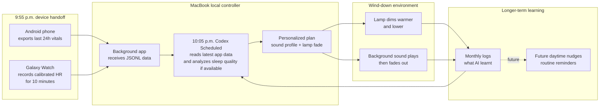

# Sleep Tight

Sleep Tight is a local-first bedtime personalization prototype. A phone, Galaxy Watch, and Mac work together each night so Codex can use the day's vitals and the final pre-sleep heart-rate window to choose a gentle light and background-sound plan.

The project avoids reacting to uncertain real-time sleep stages. Instead, it focuses on the period right before sleep, where recent behaviour, stress signals, heart rate, and routine consistency are more useful for choosing a safe wind-down environment.

## Nightly Workflow



## How It Works

1. At 9:55 p.m. daily, the phone sends the past 24 hours of vitals to the MacBook. At the same time, the Galaxy Watch starts a 10-minute calibrated heart-rate recording and sends the summary to the MacBook. The Mac app runs in the background.
2. At 10:05 p.m., Codex Scheduled runs on the Mac. It pulls the most updated data from the application, analyzes sleep quality where sleep records or sleep scores are available, suggests the type of background sound to use, and decides how the lamp should tone down.
3. The light starts dimming and the music plays to facilitate sleep.
4. Monthly logs summarize what the AI has learnt across the nights.
5. Future plans add daytime nudges that remind the user to follow habits that support the evening routine.

## How GPT-5.6 Shaped The Build

The starting idea was to run an agent overnight and let it make sleep better in the background. GPT-5.6 research changed the design direction: the strongest practical signals for this prototype come from the period right before sleep, not from trying to infer sleep stages and react while someone is already asleep.

That led to a safer workflow: look at the day's vitals, capture a final pre-bed heart-rate window, then hyper-personalize the user's wind-down environment before sleep starts.

The implementation was split into three applications:

- an Android phone app that exports Health Connect records;
- a Samsung Galaxy Watch app that runs on a timer and captures heart rate;
- a Mac app that receives local data, builds the nightly snapshot, and coordinates the recommendation.

To make the physical experience demonstrable without smart-home hardware, Codex designed a simulated lamp and background-sound scene. It also generated a 30-day simulated review so the repo can show what Codex would learn after repeated nights and how that learning would personalize the experience.

## Device Data

The phone exports granted Health Connect data, including sleep sessions and stages, heart-rate samples, resting heart rate, steps, exercise sessions, active and total calories, oxygen saturation, respiratory rate, skin temperature, floors climbed, permissions, attempted categories, and extraction errors.

The watch sends timestamped pre-bed heart-rate readings, sensor accuracy, device timestamps, sequence numbers, capture mode, correlation IDs, and a summary with window start/end, sample count, minimum, maximum, mean, and median BPM.

## Repository Map

- `phone-app/` — Android phone sync application.
- `watch-app/` — Galaxy Watch heart-rate capture application.
- `computer/` — Mac receiver, dashboard, nightly orchestration, room-command output, and monthly reporting.
- `tools/` — setup, testing, simulation, and analysis utilities.
- `research/` — evidence review, product architecture, validation plan, and future-work notes.

## Local Setup

```bash
./setup-sleep-tight --time 22:05
```

See [SETUP.md](./SETUP.md) for the full phone, watch, and Mac setup.
